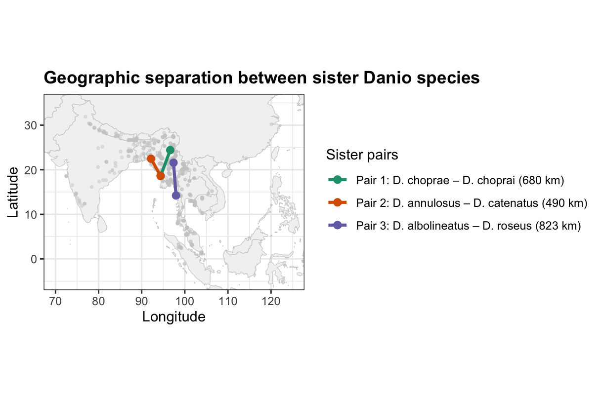

# Assignment 4 – Geography & Evolutionary Diversification in *Danio*

\*\*BINF\*6210 – Software Tools (Theme 3)**\
**Student: Indhu Ayyappan\*\*

------------------------------------------------------------------------

## Purpose of the Project

The goal of this assignment was to evaluate whether closely related *Danio* species occupy similar or different geographic regions, using a combined phylogenetic and spatial workflow:

-   COI sequences from NCBI → phylogeny\
-   Occurrence records from GBIF → geographic ranges\
-   Integrated analyses → geophylogeny, sampling intensity, sister-species comparison, richness map

------------------------------------------------------------------------

## 1. COI Phylogeny of *Danio*

The COI tree recovers multiple well defined *Danio* clades that match previously published relationships.

### **Methods**

-   Downloaded all *Danio* COI sequences from NCBI\
-   Cleaned & filtered by length (500–800 bp)\
-   Kept longest sequence per species\
-   Aligned using DECIPHER\
-   Built NJ tree (JC69) and rooted with *Microrasbora*\
-   Ladderized and Grafen-transformed for visualization\
-   Visualized with **ggtree**

**Interpretation:**\
Six recognizable clades appear, and the rooting confirms a clear split between the *Microrasbora* outgroup and the core *Danio* radiation.

------------------------------------------------------------------------

## 2. Geophylogeny: Linking the Tree to Geography

Species belonging to the same phylogenetic clade tend to cluster in the same geographic region.

### **Methods**

-   Downloaded up to 500 GBIF records per species\
-   Cleaned for coordinate issues, uncertainties, invalid points\
-   Matched species names to tree tip labels\
-   Computed species centroids\
-   Mapped centroids colored by COI clade

**Interpretation:**\
The Indo-Burman region (NE India, Bangladesh, Myanmar) forms the core geographic area for most clades, strongly mirroring phylogenetic structure.

------------------------------------------------------------------------

## 3. Sampling Intensity Across Species

Sampling bias exists and must be considered when interpreting geographic patterns.

### **Methods**

-   Counted cleaned GBIF records per species\
-   Ranked species by sampling depth

**Interpretation:**\
Sampling is highest in NE India, Bangladesh, Myanmar, and Thailand.\
Lower sampling in southern regions (Malaysia, Indonesia) may partially explain weaker richness signals there.

------------------------------------------------------------------------

## 4. Sister Species Geographic Separation

Sister pairs were identified directly from the COI phylogeny, and the geographic distance between their range centroids was calculated.

### **Methods**

-   Extracted sister pairs from the NJ tree\
-   Computed geographic centroid for each species\
-   Calculated Haversine distance (km)\
-   Drew line segments linking sister species ranges

**Interpretation:**\
Distances between sister species range from **\~490 km to \~823 km**, indicating:

-   Some pairs occupy adjacent or nearby regions → **local diversification**\
-   Others are widely separated → **historical dispersal or range shifts**

Together, this supports **both sympatric and allopatric divergence** within *Danio*.

------------------------------------------------------------------------

## 5. Species Richness Heatmap

A clear *Danio* biodiversity hotspot exists in the Indo-Burman region.

### **Methods**

-   Created a 1° × 1° richness grid\
-   Counted distinct species per cell\
-   Visualized with a **magma** heatmap

**Interpretation:**\
Richness peaks (up to 5 species per cell) occur in the eastern India–Bangladesh–Myanmar region.\
Moving east into Thailand or south toward Malaysia, richness sharply drops to 1–2 species per cell.\
This pattern mirrors the Indo-Burman hotspot seen in the phylogeny and occurrence map.

------------------------------------------------------------------------

## 6. Overall Biological Conclusion

Across all analyses:

-   Most *Danio* clades originate in the Indo-Burman biodiversity hotspot\
-   Geographic clustering aligns strongly with phylogenetic structure\
-   Sister species show a mix of **adjacent ranges and wider separations**\
-   Sampling patterns explain some absences but **do not change the core biogeographic signal**

### **Overall Conclusion**

Closely related *Danio* species tend to originate in the same broad region (Indo-Burma) but today occupy adjacent rather than overlapping ranges.\
This supports a history of **local diversification followed by range separation**, rather than widespread dispersal or strictly sympatric divergence.

------------------------------------------------------------------------
