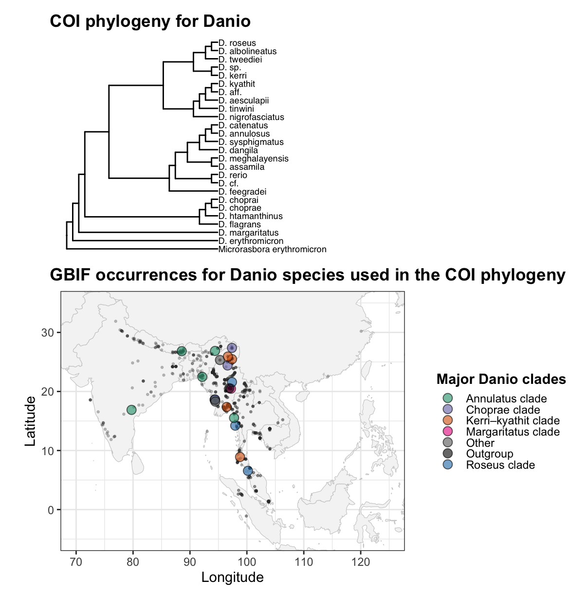

# **Assignment 4 – Geography & Evolutionary Diversification in Danio**

**Course:** BINF\*6210 – Software Tools

**Student:** Indhu Ayyappan

**Theme:** Geography & Evolutionary Diversification

## 
**Overview**

This project investigates whether closely related *Danio* species occupy similar or different geographic regions.

We integrate:

-   COI sequence data from NCBI

-   GBIF species occurrence records

-   Phylogenetic reconstruction

-   Geophylogeny mapping

-   Sampling bias assessment

-   Sister-species geographic comparison

-   Species richness heatmapping

## 
**1. COI Phylogeny**

-   One representative COI sequence per species was cleaned, aligned (**DECIPHER**), and used to compute JC69 distances.

-   A neighbor-joining tree was constructed and rooted using *Microrasbora erythromicron*.

    **Key result:**

    The phylogeny resolves **six major Danio clades**, consistent with published studies.

## 
**2. Geophylogeny : Mapping Clades to GBIF Occurrences**

GBIF occurrences were matched to phylogeny tips and plotted on an Asia map using clade-specific colours.

**Key insight:**

Species within the same clade **cluster geographically**, especially in the **Indo-Burman region** (NE India, Bangladesh, Myanmar).

## 
**3. Sampling Intensity Check**

To assess bias, raw GBIF points were visualized.

**Observation:**

Sampling effort is highest in NE India, Bangladesh, Myanmar, and Thailand.

Southern regions (Malaysia/Indonesia) are under-sampled.

## 
**4. Sister-Species Spatial Comparison**

Sister pairs extracted from the phylogeny were mapped separately.

**Biological pattern:**

Some pairs show **sympatry**, while others are strongly **allopatric**, indicating mixed diversification modes.

## 
**5. Species Richness Heatmap (1° × 1° Grid)**

GBIF occurrences were aggregated into spatial bins and visualized using a magma colour scale.

**Main takeaway:**

A strong **richness hotspot** occurs in the Indo-Burman region (up to 5 species per cell), declining eastward and southward.

## **Conclusion**

Across phylogeny, mapped occurrences, sister-pair patterns, and richness measures:

-   *Danio* species show **spatial clustering by clade**,

-   Several clades are centered in the **Indo-Burman biodiversity hotspot**,

-   Geographic patterns support a scenario of **local diversification from a shared ancestral region**.

    Overall, evolutionary relatedness and geography are strongly linked in *Danio*.
