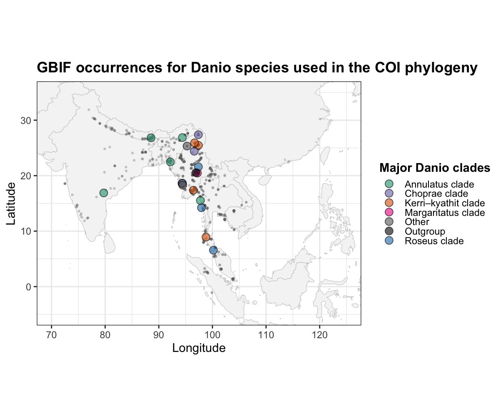

**Assignment 4 – Geography & Evolutionary Diversification in Danio**

BINF\*6210 – Software Tools (Theme 3) Student: Indhu Ayyappan

⸻

**Purpose of the project**

The goal of this assignment was to evaluate whether closely related Danio species occupy similar or different geographic regions, using a combined phylogenetic and spatial approach: • COI sequences from NCBI → phylogeny • Occurrence records from GBIF → geographic ranges • Integrated analyses → geophylogeny, sampling intensity, sister-species comparison, richness map

⸻

1.  **COI Phylogeny of Danio**

The COI tree recovers multiple well defined Danio clades that match previously published relationships.

Methods:

• Downloaded all Danio COI sequences from NCBI

• Cleaned & filtered by length (500–800 bp)

• Kept longest sequence per species

• Aligned using DECIPHER

• Built NJ tree (JC69) + rooted with Microrasbora

• Ladderized and Grafen-transformed for visualization

• Visualized with ggtree

Figure 1: COI phylogeny

Interpretation: Six recognizable clades appear, and the rooting confirms a clear split between the Microrasbora outgroup and the core Danio radiation.

⸻

2.  **Geophylogeny: Linking the Tree to Geography**

Species belonging to the same phylogenetic clade tend to cluster in the same geographic region.

Methods:

• Downloaded 500 GBIF occurrence records per species

• Cleaned for coordinate issues, uncertainties, invalid points

• Matched species names to tree tip labels

• Computed species centroids • Mapped centroids colored by COI clade

Figure 2: Geophylogeny (tree + map)

Interpretation: The Indo-Burman region (NE India, Bangladesh, Myanmar) forms the core geographic area for most clades, strongly mirroring phylogenetic structure.

⸻

3.  **Sampling Intensity Check**

Sampling bias exists and must be considered when interpreting geographic patterns.

Methods:

• Counted cleaned GBIF records per species

• Ranked species by sampling depth

Figure 3: Sampling Intensity Barplot

Interpretation:

Sampling is highest in NE India, Bangladesh, Myanmar and Thailand. Lower sampling in southern regions (Malaysia, Indonesia) may partially explain weaker richness signals there.

⸻

4.  **Sister Species Geographic Separation**

Identified sister pairs directly from the COI phylogeny and calculated the geographic distance between their GBIF derived range centroids.

Methods:

• Extracted sister pairs directly from the NJ tree

• Computed geographic centroid for each species

• Calculated haversine distance (km)

• Drew line segments linking sister ranges

Figure 4: Sister species range connections

Results:

-   Pair 1 (D. choprae – D. choprai, \~680 km):

    Not overlapping; moderately separated. Suggests range expansion or historical dispersal.

-   Pair 2 (D. annulosus – D. catenatus, \~490 km):

    Also clearly separated. Indicates allopatric divergence rather than local differentiation.

-   Pair 3 (D. albolineatus – D. roseus, \~823 km):

    Large geographic gap. Represents strong allopatry.

    Interpretation:

    All three sister pairs are geographically distinct, separated by hundreds of kilometres, suggesting primarily allopatric divergence in Danio.

    There is *no* strong evidence for sympatric sister species in this dataset.

    This fits well with the broader Indo-Burman hotspot pattern, where closely related species originate in the same general region but now occupy different subregions.

⸻

5.  **Species Richness Heatmap**

A clear Danio biodiversity hotspot exists in the Indo-Burman region.

Methods:

• Created 1°×1° richness grid

• Counted distinct species in each cell

• Visualized with a magma heatmap on an Asia base map

Figure 5: Species richness heatmap

Interpretation:

Danio species richness is strongly concentrated in the eastern India – Bangladesh – Myanmar region, where some grid cells contain up to 5 species. Moving east into Thailand or south toward Malaysia, richness drops quickly to 1–2 species per cell. This pattern mirrors the Indo-Burman biodiversity hotspot seen in the phylogeny and occurrence map.

⸻

6.  **Overall Biological Conclusion**

Across all analyses:

• Most Danio clades originate in the Indo-Burman biodiversity hotspot

• Geographic clustering aligns strongly with phylogenetic structure

• Sister species show consistent allopatry, with no truly overlapping pairs.

• Sampling patterns explain some absences but not the core biogeographic signal

**Final conclusion:**
Closely related Danio species tend to originate in the same broad region (Indo-Burma) but today occupy adjacent rather than overlapping ranges.This supports a history of local diversification followed by range separation, rather than widespread dispersal or sympatric divergence.
